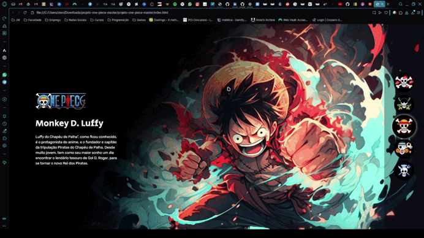

# 🏴‍☠️ Projeto One Piece

Este projeto foi desenvolvido durante a **Semana do Zero ao Programador Contratado**, oferecida pelo canal [Dev em Dobro](https://www.youtube.com/@DevemDobro).  
O objetivo foi praticar conceitos de **HTML, CSS e JavaScript**, criando uma página interativa onde é possível visualizar e alternar entre personagens da tripulação do **Chapéu de Palha**.

---

## 🚀 Tecnologias utilizadas
- **HTML5**
- **CSS3**
- **JavaScript**

---

## ⚙️ Funcionalidades
- Exibição de personagens do anime *One Piece*  
- Troca de personagem selecionado ao clicar nos botões inferiores  
- Layout responsivo para diferentes dispositivos  

---

## 📦 Como executar o projeto
1. Clone este repositório:
   ```bash
   git clone https://github.com/ottomagella/projeto-one-piece.git
2. Acesse a pasta do projeto:
   ```bash
   cd projeto-one-piece
3. Abra o arquivo index.html no navegador

---
## 📸 Demonstração


---
### 📚 Aprendizados

Durante o desenvolvimento deste projeto, aprendi a:

- **Estruturar páginas com HTML semântico**
- **Utilizar CSS para estilização e responsividade**
- **Manipular o DOM com JavaScript para alterar o conteúdo exibido dinamicamente**
